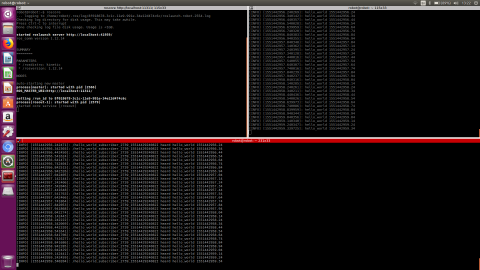

# Kreiranje paket

Komanda za kreiranje paketa:
```
catkin_create_pkg hello_world std_msgs rospy
```

Ukoliko je paket kreiran uspšno pojaviće se u wrokspace-u i sadržaće folder pod nazivom **src**, i fajlova **CMakeList.txt** i **package.txt**.

# Kreiranje skripti
Skripte (nodove) potrebno je kreirati u **src** folderu:
```
cd ~/catkin_ws/src/hello_world/src
touch hello_world_publisher.py
touch hello_world_subscriber.py
```

Kako bi omogućili operativnom sistemu da pokrene kreirane skripte potrebno je dati odgovarajuću dozvolu narednim komandama:
```
cd ~/catkin_ws/src/hello_world/src
chmod +x hello_world_publisher.py
chmod +x  hello_world_subscriber.py
```

Sada je moguće izvršiti bildovanje workspace-a komandom:
```
cd ~/catkin_ws
catkin_make
```

Sada je moguce otkucati kod u odgovarajućim skriptama.

# Pokretanje skripti
Kod je moguće pokrenuti na sledeći način:
```
rosrun hello_world hello_world_publisher.py
```
svaku sledeću skriptu je potrbno pokrenuti u zasebnom terminalu:
```
rosrun hello_world hello_world_subscriber.py
```

Napomena: potrebno je pre pokretanja bilo koje skripte pokrenuti ***roscore***.

Ukoliko je sve urađeno kako treba dobiće se sledeći prikaz:

