# Instaliraj ROS Noetic na Ubuntu 20.04 koristeći VirtualBox (na Windows)

Ovaj vodič će vam pomoći da podesite Ubuntu na virtuelnoj mašini (na Windows PC/laptop) i instalirate ROS na nju. Iako je instaliranje ROS-a na virtuelnu mašinu pogodno za nastavu i učenje, međutim, preporučuje se Dual boot instalacija za napredno korišćenje.

- Ubuntu Version: 20.04 LTS Focal Fossa

- ROS Version: ROS Noetic


## Prerequisites

- PC/Laptop running Windows
- At least 35GB of free disk space

## Steps

1. [Instalacija VirtualBox](#1-Instalacija-Virtualbox)
2. [Preuzimanje Ubuntu ISO](#2-Preuzimawe-Ubuntu-ISO)
3. [Kreiranje Virtualne Mašine](#3-Kreiranje-Virtualne-Mašine)
4. [Instaliraj Ubuntu](#4-Instaliraj-Ubuntu)
5. [Instaliraj ROS na Ubuntu](#5-Instaliraj-ROS-na-Ubuntu)

## 1. Instaliraj VirtualBox

1. Preuzeti VirtualBox za **Windows Host** [ovde](https://www.virtualbox.org/wiki/Downloads) (Verzija može biti drugačija).

   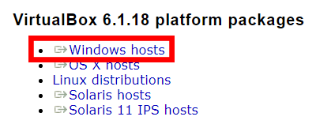

2. Pokrenuti .exe fajl i instalirati VirtualBox.

## 2. Preuzeti Ubuntu ISO

1. Preuzeti Ubuntu ISO [ovde](https://ubuntu.com/download/desktop).

   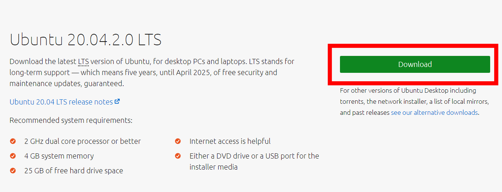

   > Preuzimanje može potrajati nekoliko minuta sobzirom da je fajl Ubuntu 20.04.2.0 LTS veličine 2.7GB.

## 3. Kreiraj Virtuelnu Mašinu

1. Otvoriti VirtualBox.

2. Kreirati novu virtuelnu mašinu klikom na `New` ikonu ili  `Machine > New`.

   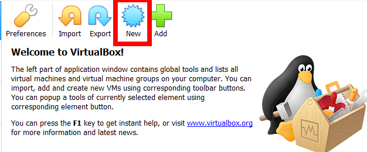
   
3. Uneti `Ubuntu` kao ime. Polja tip i verzija će automatski biti popunjena, ako ne, podesiti tip na `Linux` i verziju na `Ubuntu (64-bit)`. Kliknuti na `Next`.

   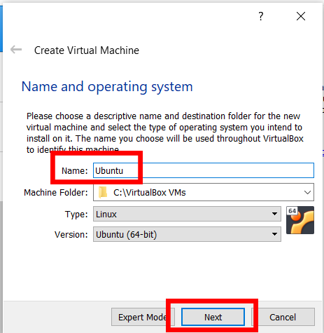

4. Povećati memoriju na `6144MB` (6GB). Ako je `6144MB` u narandžastoj ili crvenoj zoni, podesiti memoriju na `4096MB`. Kliknuti na `Next`.

   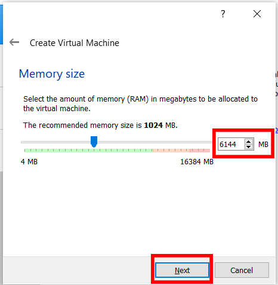

5. Selektovati `Create a virtual hard disk now` i kliknuti na `Create`.

   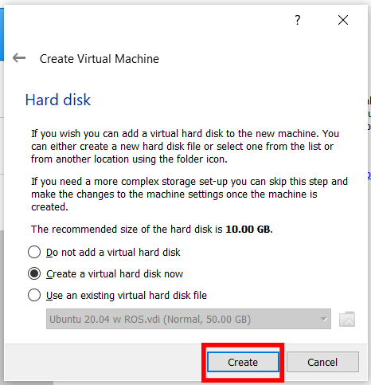

6. Selektovati `VDI (VirtualBox Disk Image)` i kliknuti `Next`.

   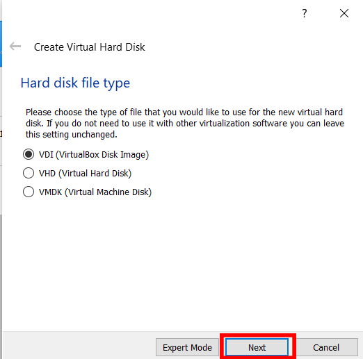

   1. Selektovati `Dynamically allocated` i kliknuti `Next`.

   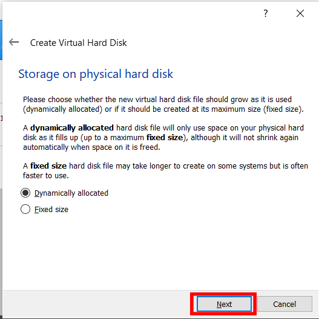

7. Promeniti veličinu hard diska na `35.00GB`. Moguće je podesiti lokaciju gde će se virtuelni hard disk sačuvati, za sada može ostati kako je inicijalno podešeno. Kliknuti na `Create`.

   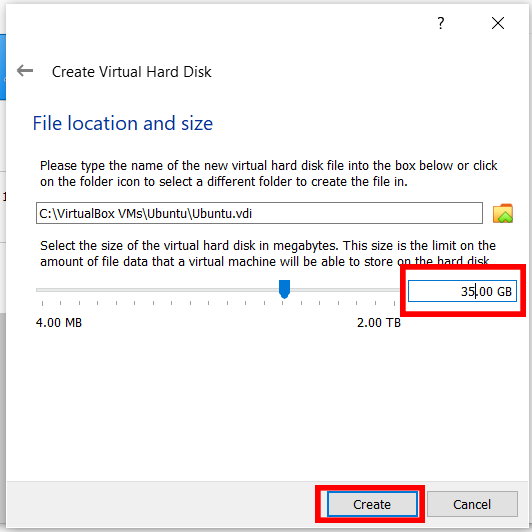

8. Kliknuti desnim klikom na novo kreiranu virtuelnu mašinu i kliknuti `Settings`. Alternativno kliknuti jednom levim klikom na virtuelnu mašinu i otići na `Machine > Settings`. 

   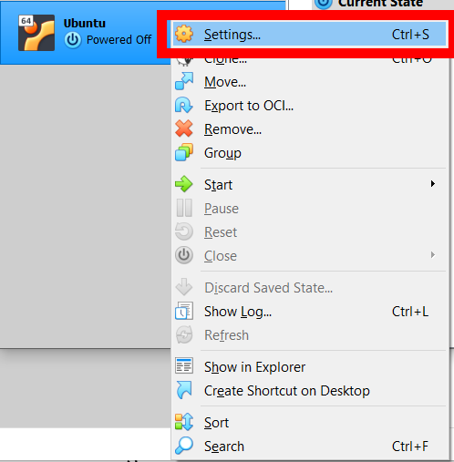

9. Naći `Storage` na meniju sa leve strane i selektovati `Storage` tab. Kliknuti na liniju sa ikonicom CDa. Sa desne strane, u okviru `Optical Drive`, kliknuti na CD ikonu sa strelicom na dole i selektovati `Choose a disk file...`. Pronaći prethodno preuzet Ubuntu ISO fajl.

  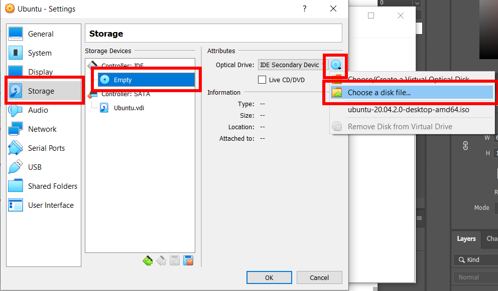

10. Naći `System` sa leve strane naći  `Processor` tab. Povećati vrednost na slajderu do granice zelene zone.

    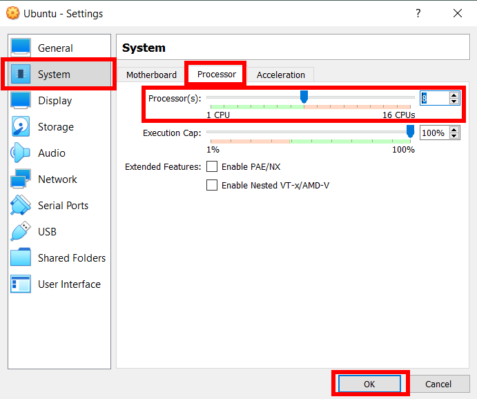

## 4. Instaliraj Ubuntu

1. Kliknuti duplim klikom na novo kreiranu virtuelnu mašinu.

   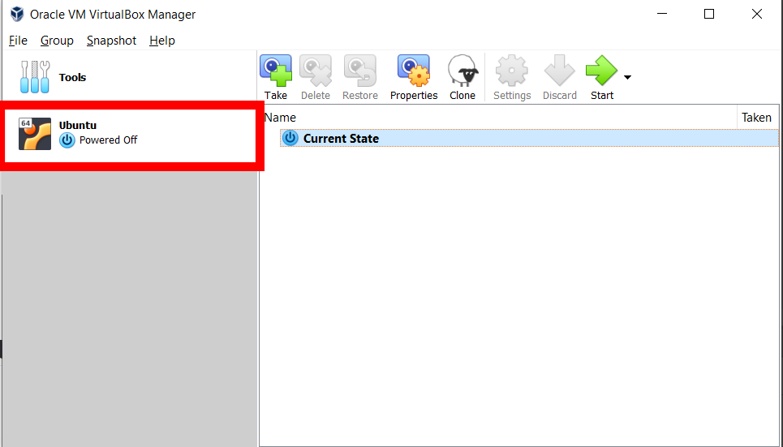

   > Vrtualna mašina će početi da se pokreće.

2. Sačekati dok virtualna mašina izvrši proveru diska.

   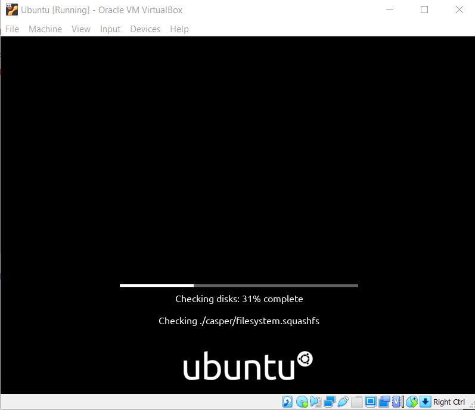

3. Selektovati `Install Ubuntu`.

   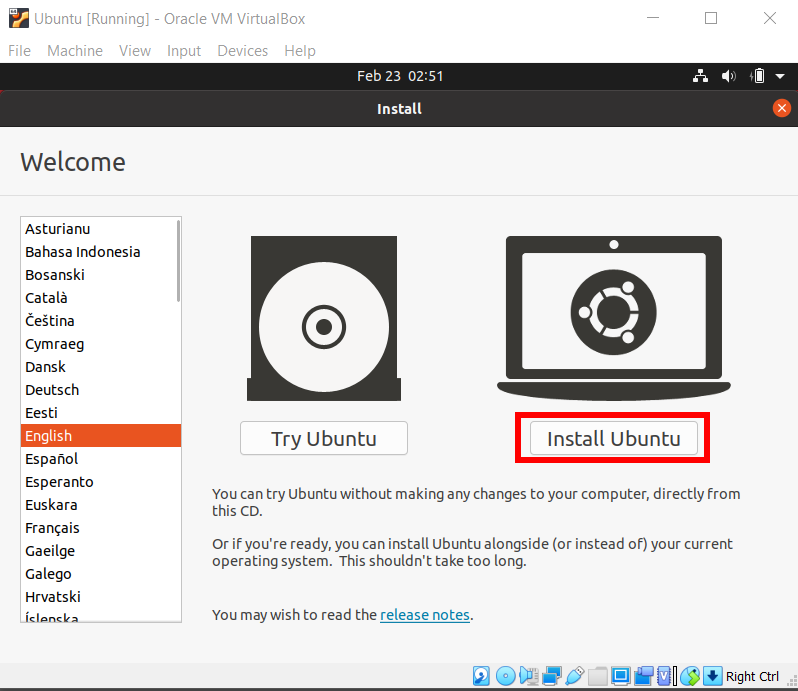

4. Izabrati postavke tastature na `English (US)`. Kliknuti `Continue`.

   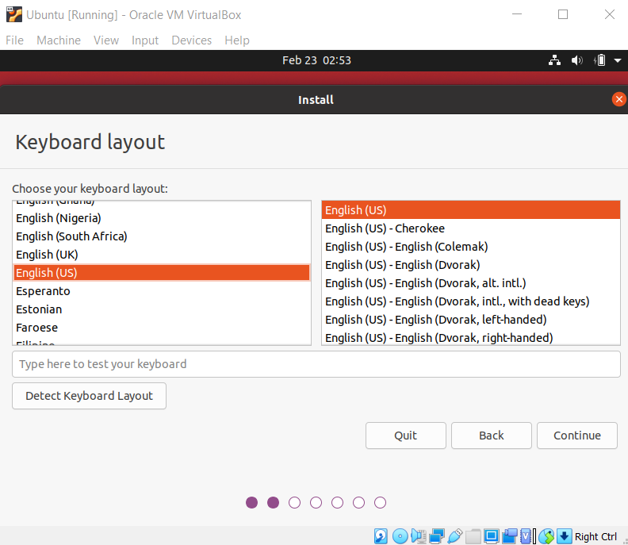

5. Selektovati `Minimal installation`, `Download updates while installing Ubuntu` i `Install third-party software for graphics and Wi-Fi hardware and additional media formats`. Klinkuti `Continue`.

   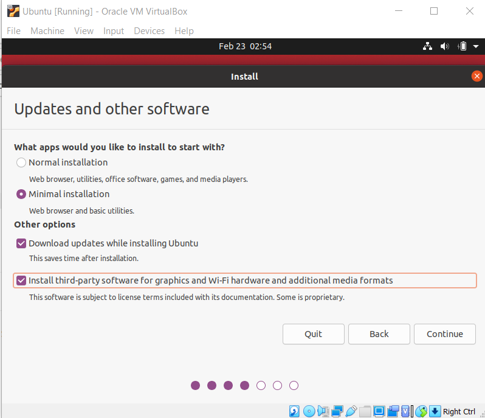

6. Selektovati `Erase disk and install Ubuntu`. Kliknuti `Install Now `a zatim kliknuti na `Continue` ukoliko se pojavi upotorenje.

   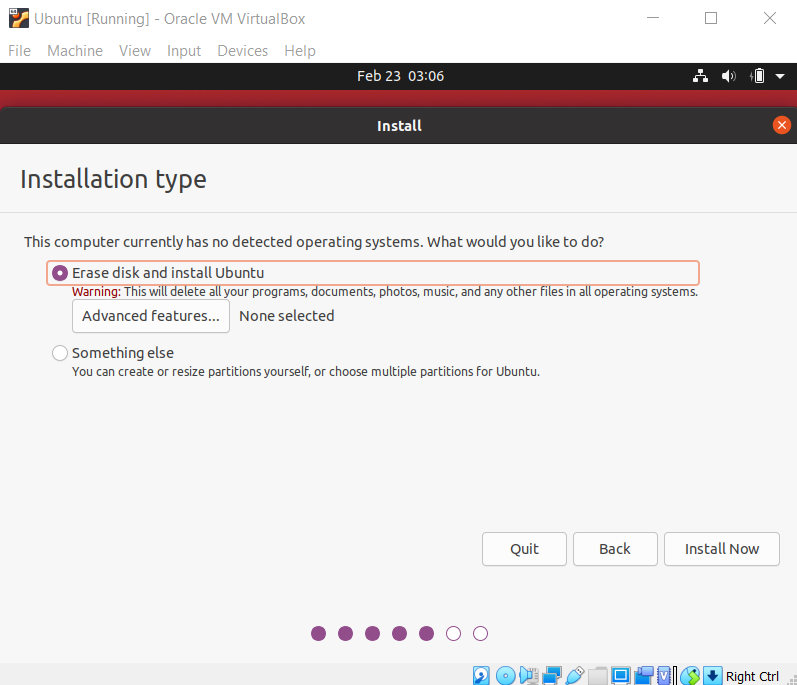

7. Izabrati zemlju/region i kliknuti `Continue`.

8. Uneti tražene informacije i kliknuti  `Continue`.

9. Sačekati dok se Ubuntu instalira. Ovaj korak može potrajati.

10. Restartovati VM. Ukoliko zatraži da se izbaci instalacioni CD, samo pritisnuti enter.

    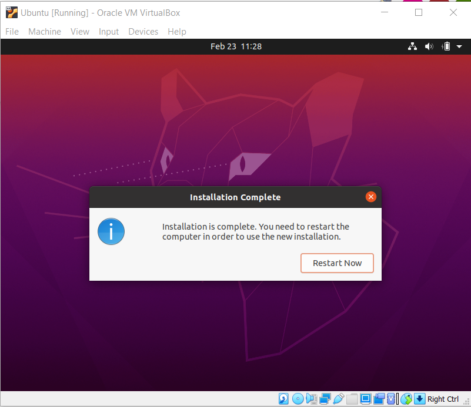

11. Čestitamo! Uspešno ste instalirali Ubuntu na virtuelnoj mašini.

## 5. Instaliraj ROS na Ubuntu

1. Pratite informacije koje možete naći [ovde](http://wiki.ros.org/noetic/Installation/Ubuntu). Komande si ispisane ispod, radi lakšeg praćenja. Ukoliko naiđete na greške pogledajti informacije i detaljniji opis sa prethodnog linka.

2. Otvoriti `Software & Updates` program pritiskom na windows taster i pretražiti `Software & Updates`.

3. Štiklirati sva polja i kliknuti na `Close`.

   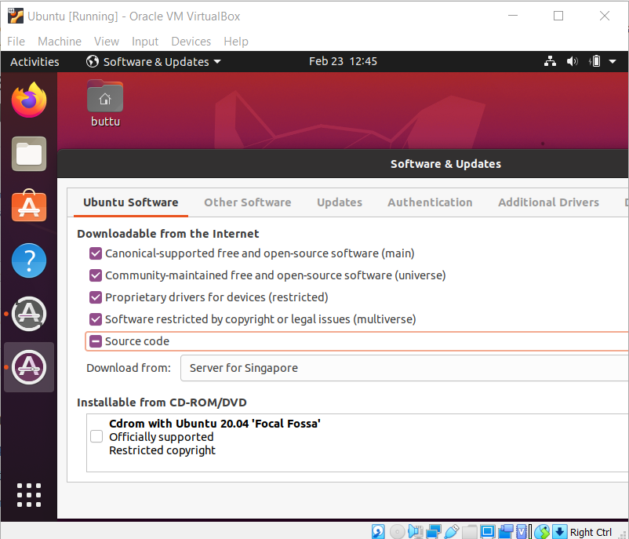

4. Kliknuti `Reload`.

5. Otvoriti terminal pritiskom na windows taster i naći `Terminal` ili koristeći prečicu sa tastature `Ctrl+Alt+T`.

6. Pokrenuti sledeće korake u datom redosledu.

    > Komande su preuzete i adaptirane sa http://wiki.ros.org/noetic/Installation/Ubuntu.

    Podesiti sources.list
    
    ```
    sudo sh -c 'echo "deb http://packages.ros.org/ros/ubuntu $(lsb_release -sc) main" > /etc/apt/sources.list.d/ros-latest.list'
    ```
    
    Podesiti keljučeve
    ```
    sudo apt-key adv --keyserver 'hkp://keyserver.ubuntu.com:80' --recv-key C1CF6E31E6BADE8868B172B4F42ED6FBAB17C654
    ```
    
    Updejtovati Debian pakete
    ```
    sudo apt update
    ```
    
    Instalirati ROS Desktop-Full
    ```
    sudo apt install -y ros-noetic-desktop-full
    ```
    
    Source setup.bash
    ```
    echo "source /opt/ros/noetic/setup.bash" >> ~/.bashrc
    source ~/.bashrc
    ```
    
    Instalirati neoophodne bibljioteke za bildovanje paketa
    ```
    sudo apt install -y python3-rosdep python3-rosinstall python3-rosinstall-generator python3-wstool build-essential
    ```
    ```
    sudo rosdep init
    rosdep update
    ```
    
    Kreirati ROS Workspace
    ```
    mkdir -p ~/catkin_ws/src
    cd ~/catkin_ws/
    catkin_make
    ```
    
    Source catkin workspace
    ```
    echo "source $(pwd)/devel/setup.bash" >> ~/.bashrc
    source ~/.bashrc
    ```
